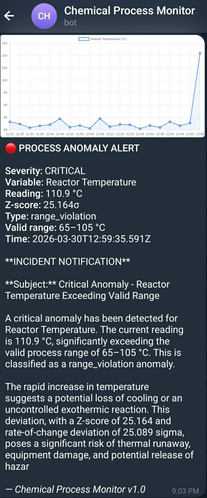
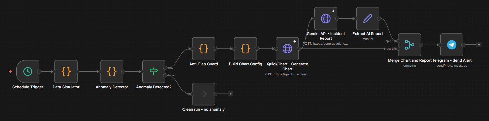
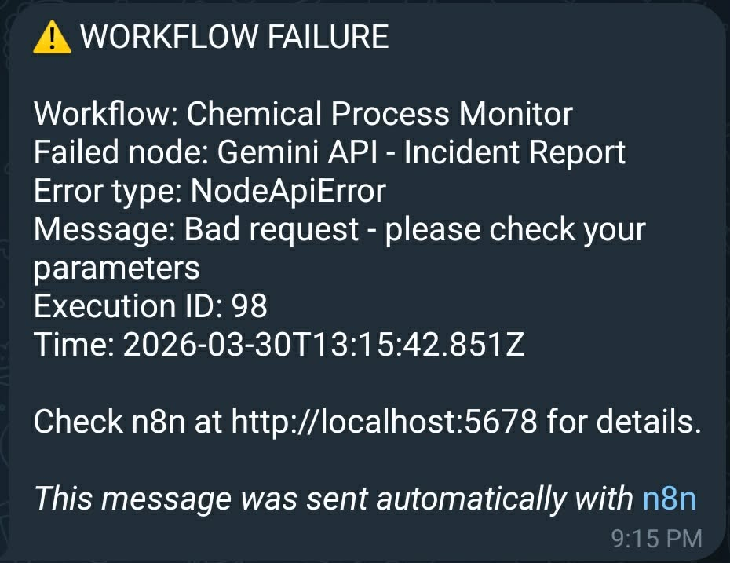

# Chemical Process Data Monitor with Anomaly Alerting

> An n8n automation workflow that monitors simulated CSTR reactor process data,
> detects statistical anomalies using engineering-grade methods, generates
> AI-written incident reports via Google Gemini, and delivers real-time alerts
> to Telegram with annotated time-series charts.

---

## Live Demo

**Anomaly Alert received on Telegram:**



**n8n Workflow Canvas:**



---

## Project Overview

This project demonstrates the intersection of chemical engineering domain knowledge
and modern AI automation engineering. The workflow simulates a continuous
stirred-tank reactor (CSTR) monitoring system, a common configuration in
pharmaceutical and specialty chemical production, and applies real statistical
process control methods to detect abnormal operating conditions.

When an anomaly is detected, the system:
1. Generates an annotated time-series chart of the affected process variable
2. Calls the Google Gemini API to write a professional incident report
3. Delivers the chart and report to Telegram within seconds

The project is built entirely on free-tier services and runs locally via Docker.

---

## Monitored Process Variables

| Variable | Baseline | Normal Range | Unit | Engineering Context |
|---|---|---|---|---|
| Reactor Temperature | 82.0 | 79–85 | °C | Exothermic reaction, jacket-cooled |
| Outlet Pressure | 3.10 | 2.9–3.3 | bar | Controlled by back-pressure regulator |
| Coolant Flow Rate | 95.0 | 85–110 | L/min | Cooling water to reactor jacket |
| Feed pH | 7.05 | 6.90–7.20 | pH | Acid/base feed; affects selectivity |

Variable ranges and alarm limits are based on typical CSTR operating conditions
for liquid-phase exothermic reactions, informed by ISA-18.2 alarm management
guidelines.

---

## Anomaly Detection Methods

Three independent statistical tests run on each variable every cycle.
No machine learning libraries are used, all methods are implemented in
plain JavaScript inside n8n's Code node.

### 1. Rolling Z-score

Uses the first 19 of 20 data points as the reference window to compute
mean (μ) and standard deviation (σ). The 20th (latest) point is then tested:
```
z = |x_latest - μ| / σ
```

**Threshold:** z > 2.5 (≈1.2% false positive rate on a Gaussian distribution)

**Key engineering decision:** The anomalous point is deliberately excluded from
the reference window. Including it would pull the mean toward the outlier and
artificially reduce the z-score, the same reasoning behind outlier-robust
statistics in process control.

### 2. Rate-of-Change (ROC) Z-score

Computes the absolute delta between consecutive readings across the full
history, then checks whether the latest delta is statistically unusual:
```
roc_z = (|x_n - x_{n-1}| - μ_delta) / σ_delta
```

**Threshold:** roc_z > 3.0

**Why this matters:** A slow drift anomaly may not trigger the absolute z-score
until it is too late, the value creeps up gradually while the mean shifts
with it. The ROC test catches this early because the *rate* of change becomes
statistically significant before the *absolute value* does. This is analogous
to the derivative term (D) in a PID controller.

### 3. Hard Range Violation

Compares the latest reading against engineering-defined absolute limits
regardless of statistical scores:
```
CRITICAL if: x < min_valid OR x > max_valid
```

No statistical test is needed here, a pressure reading above the system's
rated maximum is immediately critical.

### 4. Sensor Dropout Detection

Checks if the last three readings are identical within a tolerance of 1×10⁻⁶.
A frozen sensor reading is a known DCS failure mode where the last known value
is held indefinitely.

### Severity Classification

| Condition | Severity |
|---|---|
| Hard range violation | Critical |
| Sensor dropout | High |
| Z-score AND ROC both triggered | High |
| Z-score only | Medium |
| ROC only | Medium |
| Alarm limit breach | Low |

---

## Simulated Anomaly Types

The data simulator randomly injects one of four realistic failure modes:

| Type | Description | Real-world cause |
|---|---|---|
| Spike | Sudden 4–7σ deviation on last reading | Valve slam, sensor fault |
| Drift | Gradual 5σ drift over last 10 readings | Fouling, slow leak |
| Dropout | Sensor reading freezes at last value | Transmitter failure |
| Range violation | Reading exceeds absolute instrument limit | Catastrophic failure |

---

## Alert Deduplication

An anti-flap guard prevents alert storms. If the same variable triggers
an anomaly within 30 minutes of the previous alert, the notification is
suppressed. Critical-severity anomalies bypass the cooldown and always alert.

This uses n8n's workflow static data storage, a lightweight key-value
store that persists between executions without requiring an external database.

---

## Error Handling

A separate Error Handler workflow is linked to the main workflow via n8n's
built-in error workflow setting. Any unhandled exception in any node
automatically triggers a plain-text Telegram notification with the
failed node name, error type, and execution ID.



Non-critical nodes (QuickChart, Gemini API) are set to
**Continue on Fail** if the chart or AI report cannot be generated,
a degraded alert is still sent to Telegram rather than nothing at all.

---

## Tech Stack

| Component | Tool | Purpose |
|---|---|---|
| Automation platform | n8n (self-hosted, Docker) | Workflow orchestration |
| Data simulation | n8n Code node (JavaScript) | CSTR process data generation |
| Anomaly detection | n8n Code node (JavaScript) | Statistical process monitoring |
| Chart generation | QuickChart.io API | Time-series PNG generation |
| AI summarization | Google Gemini API (free tier) | Incident report generation |
| Alert delivery | Telegram Bot API | Real-time notifications |
| Containerization | Docker + Docker Compose | Local deployment |

---

## Project Structure
```
chemical-process-monitor/
├── README.md
├── docker-compose.yml
├── .env.example
├── .gitignore
├── docs/
│   ├── sample_alert.png
│   ├── workflow_canvas.png
│   └── error_alert.png
└── workflow/
    ├── chemical_monitor.workflow.TEMPLATE.json
    ├── error_handler.workflow.TEMPLATE.json
    └── SETUP_INSTRUCTIONS.md
```

---

## Setup and Deployment

### Prerequisites

- Docker Desktop installed and running
- A Telegram account and bot token (via @BotFather)
- A Google account for the Gemini API free tier

### Quick Start
```bash
# 1. Clone the repository
git clone https://github.com/AdrianeJone/chemical-process-monitor.git
cd chemical-process-monitor

# 2. Copy and fill in environment variables
cp .env.example .env
# Edit .env with your actual values

# 3. Start n8n
docker compose up -d

# 4. Open n8n at http://localhost:5678
# 5. Import workflow templates from the workflow/ folder
# 6. Configure credentials (see workflow/SETUP_INSTRUCTIONS.md)
# 7. Publish both workflows
```

---

## About This Project

This project was built as a portfolio piece during a career transition from
licensed Chemical Engineering practice into AI automation engineering.

The domain knowledge embedded in this project, CSTR operating parameters,
ISA-18.2 alarm management principles, process failure mode classification,
and the engineering rationale behind statistical threshold selection, reflects
real chemical engineering practice, not generic sensor monitoring.

**Author:** Adriane Jone A. Abunda  
**Background:** BS Chemical Engineering (MSU-IIT), currently pursuing MEng in Artificial Intelligence at the University of the Philippines Diliman  
**GitHub:** [github.com/AdrianeJone](https://github.com/AdrianeJone)  
**LinkedIn:** [linkedin.com/in/adriane-jone-abunda](https://linkedin.com/in/adriane-jone-abunda)